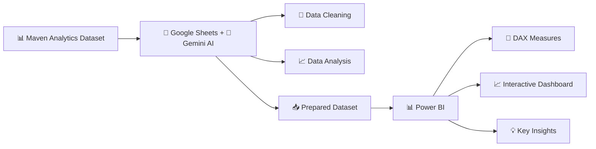

# 🎧 Spotify Listening Insights Analysis

## Objective

This project analyzes Spotify listening behaviour to identify patterns in listener engagement, skip behaviour, device usage, listening trends, and artist preferences, using data cleaning, analysis, and interactive visualisation.

## Tech Stack

* **Google Sheets** – Data preparation and initial analysis
* **Gemini AI** – Assisted data cleaning and analysis within Google Sheets
* **Power BI** – Data modelling, DAX measures, and interactive dashboard development

## 🔄 Project Workflow

## Links
- **Dataset:** [Maven Analytics](https://mavenanalytics.io/data-playground/spotify-streaming-history)
- **Google Sheets:** [View Google Sheet](https://docs.google.com/spreadsheets/d/1J_yARZRbYppUEj1G6vPTBK6RrSureUaWVMyWr02NvPo/edit?gid=0#gid=0)
- **Power BI Dashboard:** [View Dashboard](https://app.powerbi.com/groups/me/reports/eea72d93-fd22-4b78-ad34-296d496d038e/7f1f7e6f71bacebc2756?experience=power-bi)

## Google Sheets with Gemini AI

## Dashboard

## Key Insights

* **App Load (15%)** and **track errors (13%)** are the leading causes of skips, highlighting **playback reliability as a key factor in listener retention**.

* Listening activity **peaked at around 55K plays in 2020–2021** before declining, indicating a **significant change in overall listening engagement over time**.

* **Desktop users show a 74% attention rate compared with 50% on mobile**, indicating that **listening sessions on desktop tend to be more engaged**.

* **The Beatles lead with 336+ hours of listening**, followed by **The Killers with 294+ hours**, showing that **listening time is concentrated among a few top artists**.

* With an overall **52% completion rate**, a substantial share of tracks are left unfinished, pointing to **potential opportunities to improve listener retention**.

* **Friday has the highest listening activity**, suggesting that **engagement increases toward the end of the week**.

## 💡 What I Learned

Gemini AI in Google Sheets helped me **reduce tedious data cleaning and analysis time**, allowing me to focus more on extracting insights. I then imported the prepared data into Power BI for **DAX calculations and interactive visualisation**.
